# Okta Identity Lifecycle Management — Joiner Mover Leaver (JML)
### BambooHR · Okta · SterlingBank · scim.dev

> A hands-on implementation of a complete enterprise identity lifecycle using Okta as the Identity Provider, BambooHR as the authoritative HR source, and a SterlingBank application as the downstream resource server. This lab demonstrates automated user provisioning, attribute synchronisation, group-based access control, and deprovisioning — validated end-to-end using scim.dev as a live SCIM 2.0 test sink.

---

## 📋 Table of Contents

- [Overview](#overview)
- [System Architecture](#system-architecture)
- [JML Lifecycle Flow](#jml-lifecycle-flow)
- [Prerequisites](#prerequisites)
- [Lab Steps](#lab-steps)
  - [Step 1 — Connect BambooHR to Okta](#step-1--connect-bamboohr-to-okta)
  - [Step 2 — Configure Import and Lifecycle Sourcing Rules](#step-2--configure-import-and-lifecycle-sourcing-rules)
  - [Step 3 — Import Users from BambooHR](#step-3--import-users-from-bamboohr)
  - [Step 4 — Create a Dynamic Group in Okta](#step-4--create-a-dynamic-group-in-okta)
  - [Step 5 — Get a Free SCIM Test Endpoint (scim.dev)](#step-5--get-a-free-scim-test-endpoint-scimdev)
  - [Step 6 — Add the SCIM 2.0 Test App in Okta](#step-6--add-the-scim-20-test-app-in-okta)
  - [Step 7 — Connect Okta to scim.dev and Enable Provisioning](#step-7--connect-okta-to-scimdev-and-enable-provisioning)
  - [Step 8 — Assign the Application to the Dynamic Group](#step-8--assign-the-application-to-the-dynamic-group)
  - [Step 9 — Test the Joiner Workflow](#step-9--test-the-joiner-workflow)
  - [Step 10 — Test the Mover Workflow](#step-10--test-the-mover-workflow)
  - [Step 11 — Test the Leaver Workflow](#step-11--test-the-leaver-workflow)
- [Screenshots](#screenshots)
- [JML Workflow Reference](#jml-workflow-reference)
- [Best Practices Summary](#best-practices-summary)
- [Key Concepts Reference](#key-concepts-reference)
- [Resources](#resources)

---

## Overview

This lab implements a **Joiner Mover Leaver (JML) identity lifecycle** — the foundational pattern of enterprise IAM — across three systems in an automated, unidirectional provisioning chain:

| System | Role | Responsibility |
|---|---|---|
| **BambooHR** | Authoritative Source — HR System of Record | Owns employee identity data. Creates, updates, and terminates employee records. All identity events originate here. |
| **Okta** | Identity Broker — Identity Provider (IdP) | Receives employee records from BambooHR on a scheduled import. Evaluates dynamic group membership rules. Pushes provisioning events downstream via SCIM. |
| **SterlingBank App** | Resource Server — Service Provider (SP) | Receives provisioned users from Okta via SCIM 2.0. Grants application access based on group membership. Validated in this lab using scim.dev as the SCIM endpoint. |

**The foundational principle:** Identity data flows in one direction only — from HR downstream to applications. No application creates or owns identity data. BambooHR is always the single source of truth.

---

## System Architecture

```
╔═════════════════════════════════════════════════════════════════════════════╗
║              OKTA JML LIFECYCLE — SYSTEM ARCHITECTURE                      ║
╚═════════════════════════════════════════════════════════════════════════════╝

  ┌─────────────────────────────────────────────────────────────────────────┐
  │                        AUTHORITATIVE SOURCE                             │
  │                                                                         │
  │   ┌──────────────────────────────────────────────────────────────────┐  │
  │   │                        BambooHR                                  │  │
  │   │                                                                  │  │
  │   │   Employee Records                                               │  │
  │   │   ┌──────────┐  ┌────────────┐  ┌───────────┐  ┌─────────────┐ │  │
  │   │   │firstName │  │ lastName   │  │department │  │    title    │ │  │
  │   │   └──────────┘  └────────────┘  └───────────┘  └─────────────┘ │  │
  │   │   ┌──────────┐  ┌────────────┐                                  │  │
  │   │   │  email   │  │   status   │                                  │  │
  │   │   └──────────┘  └────────────┘                                  │  │
  │   └──────────────────────────┬───────────────────────────────────────┘  │
  └────────────────────────────  │  ───────────────────────────────────────┘
                                 │
                    Scheduled Import (hourly)
                    Full sync — no real-time webhook
                                 │
  ┌─────────────────────────────▼───────────────────────────────────────────┐
  │                         IDENTITY BROKER                                 │
  │                                                                         │
  │   ┌──────────────────────────────────────────────────────────────────┐  │
  │   │                           Okta                                   │  │
  │   │                                                                  │  │
  │   │  ① Import user profile from BambooHR                            │  │
  │   │              │                                                   │  │
  │   │              ▼                                                   │  │
  │   │  ② Evaluate dynamic group rule:                                  │  │
  │   │                                                                  │  │
  │   │     IF user.department == "IT"                                   │  │
  │   │     AND user.title == "security engineer"                         │  │
  │   │     ─────────────────────────────────                            │  │
  │   │     TRUE  → add to "SterlingBank IT Admin"                       │  │
  │   │     FALSE → not assigned / removed                               │  │
  │   │              │                                                   │  │
  │   │              ▼                                                   │  │
  │   │  ③ Group assigned to SterlingBank SCIM Practice App              │  │
  │   │              │                                                   │  │
  │   │              ▼                                                   │  │
  │   │  ④ SCIM provisioning event triggered                             │  │
  │   └──────────────────────────┬───────────────────────────────────────┘  │
  └─────────────────────────── ─ │ ────────────────────────────────────────┘
                                 │
                    SCIM 2.0 over HTTPS
                    POST / PATCH / GET
                    Authorization: Bearer <api-key>
                                 │
  ┌─────────────────────────────▼───────────────────────────────────────────┐
  │                         RESOURCE SERVER                                 │
  │                                                                         │
  │   ┌──────────────────────────────────────────────────────────────────┐  │
  │   │              SterlingBank SCIM Practice App                      │  │
  │   │              (validated via scim.dev sandbox)                    │  │
  │   │                                                                  │  │
  │   │  Joiner  → POST   /Users          → user account created         │  │
  │   │  Mover   → PATCH  /Users/{id}     → user attributes updated      │  │
  │   │  Leaver  → PATCH  /Users/{id}     → active: false                │  │
  │   └──────────────────────────────────────────────────────────────────┘  │
  └─────────────────────────────────────────────────────────────────────────┘
```

---

## JML Lifecycle Flow

```
╔═════════════════════════════════════════════════════════════════════════════╗
║                      JOINER · MOVER · LEAVER                               ║
╚═════════════════════════════════════════════════════════════════════════════╝

  JOINER                      MOVER                       LEAVER
  ──────────────────          ──────────────────          ──────────────────
  New employee created        Employee profile            Employee terminated
  in BambooHR                 updated in BambooHR         or deleted in
  (dept=IT,                   (name, title,               BambooHR
   title=Senior Dev)           department)
          │                          │                           │
          ▼                          ▼                           ▼
  Okta scheduled              Okta scheduled              Okta scheduled
  import detects              import detects              import detects
  new user record             changed attributes          removed record
          │                          │                           │
          ▼                          ▼                           ▼
  Dynamic group rule          Dynamic group rule          User deactivated
  evaluated:                  re-evaluated:               in Okta
  dept=IT ✅                  If attributes no longer          │
  title=Senior Dev ✅         match rule criteria,             ▼
  → Added to                  user removed from           User removed from
    SterlingBank              SterlingBank IT Admin       SterlingBank
    IT Admin group                   │                    IT Admin group
          │                          ▼                           │
          ▼                   SCIM PATCH sent to                 ▼
  App assigned to user        scim.dev with             SCIM PATCH sent to
  via group membership        updated attributes        scim.dev:
          │                                             { "active": false }
          ▼
  SCIM POST /Users sent
  to scim.dev:
  user account created
          │
          ▼
  User can authenticate
  via Okta SSO and
  access SterlingBank app
```

---

## Prerequisites

| Requirement | Detail |
|---|---|
| **Okta tenant** | Developer or production org with Super Administrator access |
| **BambooHR tenant** | Trial or production org with API access enabled; test employees pre-populated |
| **BambooHR subdomain** | The prefix of your BambooHR URL (e.g. `wayneenterprise` from `wayneenterprise.bamboohr.com`) |
| **scim.dev account** | Free — no sign-up required; API key generated on first visit |
| **Test employee** | At least one BambooHR employee with `department = IT` and `title = security engineer` to trigger the dynamic group rule |
| **Okta P1 license** | Required for BambooHR provisioning and group rules (included in developer tenants) |

> **No custom server, no Docker, no ngrok required.** This lab uses `scim.dev` as the SCIM endpoint — a free, browser-based SCIM 2.0 sandbox. All provisioning events are observed in real time through its HTTP log viewer.

---

## Lab Steps

---

### Step 1 — Connect BambooHR to Okta

**Goal:** Register BambooHR as an application integration in Okta and authenticate the API connection so Okta can read and import employee data.

1. Sign in to your **Okta Admin Console** (`https://your-org.okta.com/admin`).
2. Navigate to **Applications** → **Applications** → **Browse App Catalog**.
3. Search for `BambooHR` and select the result.
4. Click **Add Integration**.
5. On the **General Settings** tab, enter your BambooHR **subdomain name**.
   - Example: if your BambooHR URL is `wayneenterprise.bamboohr.com`, the subdomain is `wayneenterprise`
6. Click **Done**.
7. On the new integration page, navigate to the **Provisioning** tab.
8. Click **Configure API Integration**.
9. Click **Authenticate with BambooHR**.
   - A BambooHR OAuth window will open — authorise the connection.
10. Confirm the success message: **BambooHR API is authenticated.**
11. Click **Save**.

> **What this establishes:** Okta now holds authenticated API credentials for your BambooHR tenant. It can read employee records, department assignments, job titles, and group memberships on a scheduled import cycle. BambooHR becomes the authoritative source — Okta becomes the consumer.

#### Screenshot
<!-- Add your screenshot here -->
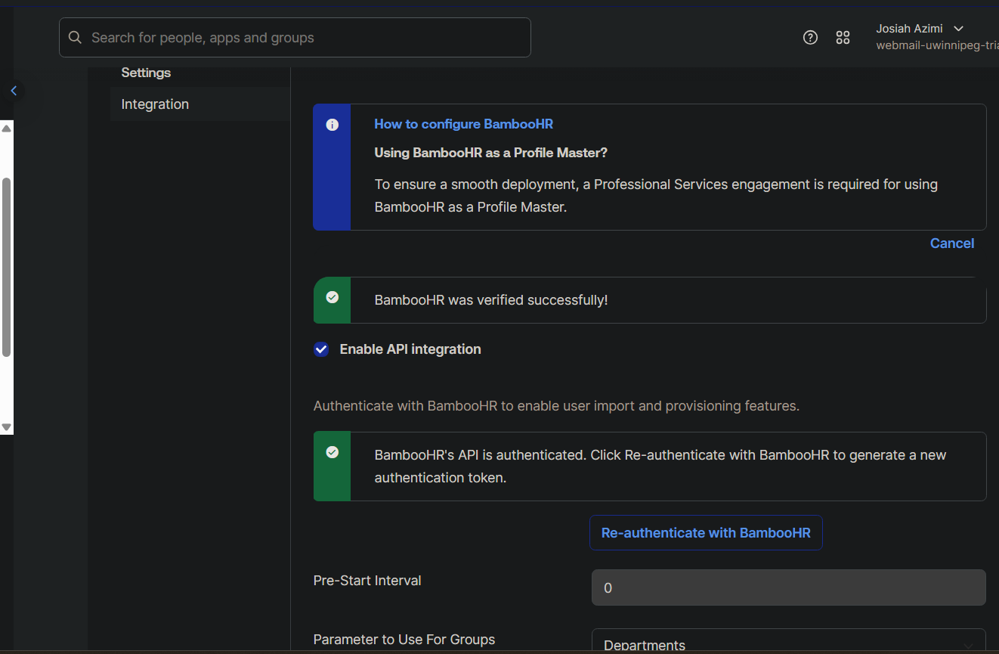

---

### Step 2 — Configure Import and Lifecycle Sourcing Rules

**Goal:** Define the import schedule and specify how HR-driven lifecycle events — deactivation, reactivation — propagate from BambooHR into Okta.

1. On the BambooHR integration page, click the **Provisioning** tab.
2. Under **To Okta**, click **Edit**.
3. Set the **Schedule import** frequency to **Every hour**.

   > BambooHR does not support real-time webhook sync. A scheduled import is the only available mechanism — plan your offboarding SLA around the maximum one-hour delay this introduces.

4. Under **Profile & Lifecycle Sourcing**, configure:

   | Setting | Value | Rationale |
   |---|---|---|
   | Allow BambooHR to source Okta users | **Enabled** | Makes BambooHR the profile authority — Okta will not allow manual overrides to HR-owned attributes |
   | When a user is deactivated in BambooHR | **Deactivate the user in Okta** | Drives the Leaver workflow automatically |
   | When a user is reactivated in BambooHR | **Reactivate suspended Okta users** | Supports rehire scenarios |

5. Click **Save**.

> **Identity drift prevention:** When BambooHR is enabled as the profile source, any attempt to manually edit HR-owned attributes in Okta (name, department, title) will be overwritten on the next import. All authoritative changes must originate in BambooHR. This is the correct architecture — it ensures the HR system always remains the single source of truth.

#### Screenshot
<!-- Add your screenshot here -->
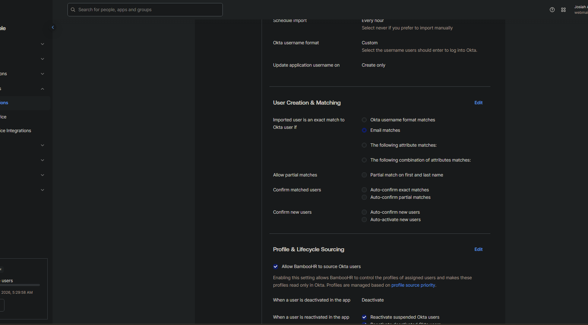

---

### Step 3 — Import Users from BambooHR

**Goal:** Trigger an immediate full import to pull current BambooHR employees into Okta without waiting for the hourly schedule.

1. On the BambooHR integration page, click the **Import** tab.
2. Click **Import Now**.
3. Wait for the import to complete. The summary will show:
   - **New users found**
   - **Existing users updated**
   - **Groups detected**
4. For each new user detected, select **Managed** to bring them under Okta lifecycle management.
5. Click **Confirm Assignments**.
6. Navigate to **Directory** → **Groups** and review the imported BambooHR groups.

   > BambooHR-sourced groups are read-only in Okta — membership is controlled by BambooHR and cannot be manually edited. These groups reflect org chart structure. You will build your own Okta-native dynamic groups in Step 4 for application access control.

#### Screenshot
<!-- Add your screenshot here -->
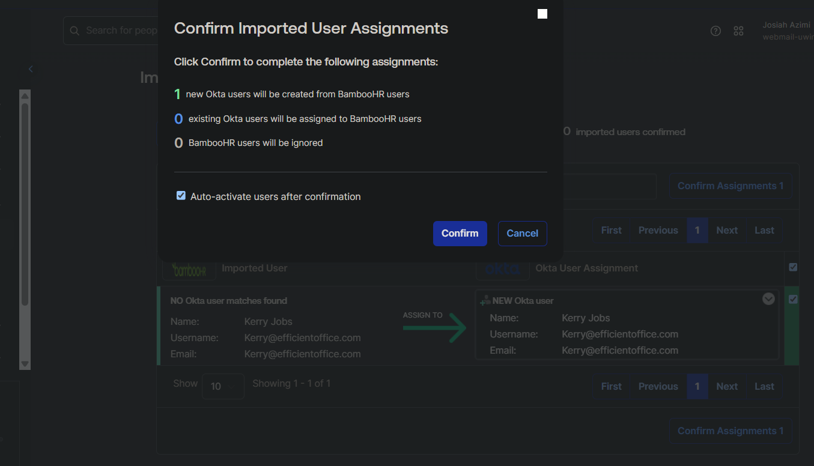

---

### Step 4 — Create a Dynamic Group in Okta

**Goal:** Create an Okta group whose membership is automatically managed by an expression rule — adding users whose BambooHR attributes match the target criteria, and removing them when they no longer match.

```
Dynamic Group Rule — SterlingBank IT Admin
───────────────────────────────────────────
Incoming BambooHR profile attributes
              │
              ▼
    Rule evaluation (Okta Expression Language):

    user.department == "IT"
    AND user.title == "security engineer"
    ──────────────────────────────────────
    TRUE  → User added to "SterlingBank IT Admin"
    FALSE → User not assigned (or removed if previously assigned)
```

**Steps:**

1. Navigate to **Directory** → **Groups**.
2. Click **Add Group**.
3. Enter the group name: `SterlingBank IT Admin`
4. Click **Save**.
5. Open the group and click **Manage Rules** → **Add Rule**.
6. Configure the rule:
   - **Rule name:** `IT security engineer Rule`
   - **IF (condition):**
     ```
     user.department == "IT" AND user.title == "security engineer"
     ```
   - **THEN assign to group:** `SterlingBank IT Admin`
7. Click **Save Rule**.
8. Click **Activate**.
9. Return to the group — Okta immediately evaluates the rule against all current users.
10. Confirm that your test employee (e.g. Kerry Jobs, IT / security engineer) appears as a member.

> **Why dynamic groups, not manual assignment?** When a user's department or title changes in BambooHR, Okta re-evaluates the rule on the next import cycle. If they no longer match, they are automatically removed from the group — and from any applications assigned through it. No manual action required. This is the correct pattern for attribute-driven access control at scale.

#### Screenshot
<!-- Add your screenshot here -->
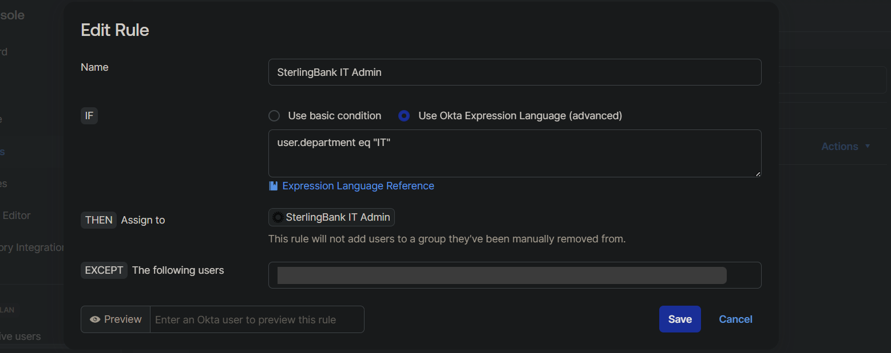

---

### Step 5 — Get a Free SCIM Test Endpoint (scim.dev)

**Goal:** Obtain a live, authenticated SCIM 2.0 endpoint to receive Okta provisioning events — without building or hosting any server.

```
What scim.dev provides
──────────────────────────────────────────────────────────────
Base URL:        https://api.scim.dev/scim/v2
Auth mode:       HTTP Header — Bearer <your-api-key>
Endpoints:       /Users    /Groups
HTTP log viewer: Real-time log of every request Okta sends,
                 with full request headers and JSON body
User inspector:  View, search, and inspect created/updated/
                 deactivated user records
Cost:            Free — no account registration required
```

> **Why scim.dev instead of a custom server?** Okta is a SCIM *client* — it sends outbound HTTP requests whenever provisioning events occur. All you need is a compliant endpoint to receive and log them. `scim.dev` provides a fully functional SCIM 2.0 sandbox in under a minute, with no code, no Docker, and no tunnel required. It is the fastest way to observe and validate Okta's SCIM behaviour in a lab environment.

**Steps:**

1. Open a new browser tab and navigate to [https://scim.dev](https://scim.dev).
2. Click **Get an API Key**, accept the terms, and click **Access My Playground**.
3. **Copy your API Key** from the playground page — you will paste this into Okta in Step 7.
4. Your SCIM base URL is fixed:
   ```
   https://api.scim.dev/scim/v2
   ```
5. Keep this tab open throughout the lab — you will return here to observe live HTTP logs for each JML phase test.

#### Screenshot
<!-- Add your screenshot here -->
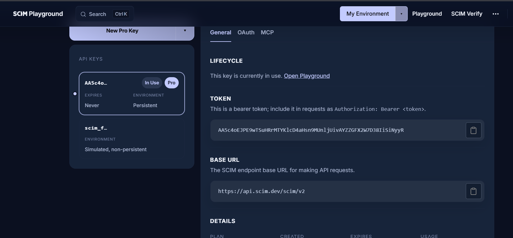

---

### Step 6 — Add the SCIM 2.0 Test App in Okta

**Goal:** Register Okta's built-in SCIM 2.0 catalog test application — a pre-configured integration designed to exercise the full SCIM provisioning surface.

> **Why the catalog test app?** The `SCIM 2.0 Test App (Header Auth)` is maintained by Okta specifically for SCIM validation. It removes the SAML configuration requirement so the lab stays focused entirely on provisioning mechanics — Create, Update, Deactivate, and Group Push.

1. In the Okta Admin Console, navigate to **Applications** → **Applications**.
2. Click **Browse App Catalog**.
3. Search for `SCIM 2.0 Test App (Header Auth)`.
4. Select the result and click **Add Integration**.
5. Enter the application name: `SterlingBank SCIM Practice App`
6. Click **Next** → on the **Sign-On Options** tab, leave defaults → click **Done**.

The application is now registered in Okta with no SCIM endpoint connected. That is configured in Step 7.

#### Screenshot
<!-- Add your screenshot here -->
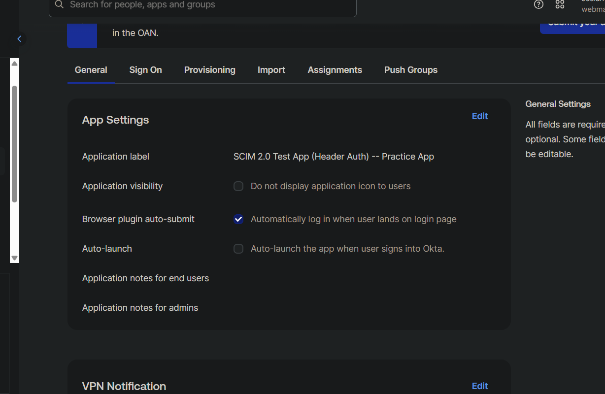

---

### Step 7 — Connect Okta to scim.dev and Enable Provisioning

**Goal:** Point Okta's SCIM client at the `scim.dev` endpoint, verify the connection, and enable the three provisioning actions that map to each JML lifecycle phase.

#### 7a — Configure the SCIM API Connection

1. On the `SterlingBank SCIM Practice App` page, click the **Provisioning** tab.
2. Click **Configure API Integration** → check **Enable API Integration**.
3. Enter the following:

   | Field | Value |
   |---|---|
   | **SCIM connector base URL** | `https://api.scim.dev/scim/v2` |
   | **Unique identifier field for users** | `userName` |
   | **Authentication Mode** | `HTTP Header` |
   | **Authorization** | Paste the API Key copied from `scim.dev` in Step 5 |

4. Click **Test API Credentials**.
   - A green checkmark confirms Okta has successfully reached and authenticated with `scim.dev`.
5. Click **Save**.

```
SCIM Communication Model
─────────────────────────────────────────────────
Okta (SCIM Client)
    │
    │  All requests sent over HTTPS
    │  Host: api.scim.dev
    │  Authorization: Bearer <api-key>
    │
    ├── POST   /scim/v2/Users          → Create user (Joiner)
    ├── PATCH  /scim/v2/Users/{id}     → Update attributes (Mover)
    ├── PATCH  /scim/v2/Users/{id}     → Deactivate user (Leaver)
    │          body: { "active": false }
    └── GET    /scim/v2/Users          → Okta reconciliation check
```

> **HTTPS is non-negotiable for SCIM in production.** SCIM endpoints can create, update, and delete user accounts — they are privileged endpoints equivalent to a directory write API. `scim.dev` enforces HTTPS natively. Never expose a SCIM endpoint over plain HTTP.

#### Screenshot
<!-- Add your screenshot here -->
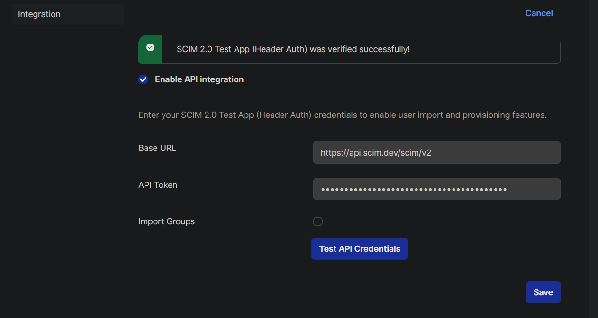

#### 7b — Enable Provisioning Actions (To App)

6. On the **Provisioning** tab, click **To App** in the left panel.
7. Click **Edit** and enable:

   | Action | JML Phase | SCIM Call Okta Sends |
   |---|---|---|
   | ✅ **Create Users** | **Joiner** | `POST /Users` when a user is assigned to the app |
   | ✅ **Update User Attributes** | **Mover** | `PATCH /Users/{id}` when a user profile is updated in Okta |
   | ✅ **Deactivate Users** | **Leaver** | `PATCH /Users/{id}` with `"active": false` when a user is removed or deactivated |

8. Leave **Sync Password** unchecked — passwords are not managed by SCIM; authentication is handled by Okta SSO.
9. Do **not** enable **Import Users** or **Import Groups** — `scim.dev` is a test sink, not an authoritative source. Enabling import would create circular data flow that overwrites BambooHR identity data.
10. Click **Save**.

#### Screenshot
<!-- Add your screenshot here -->
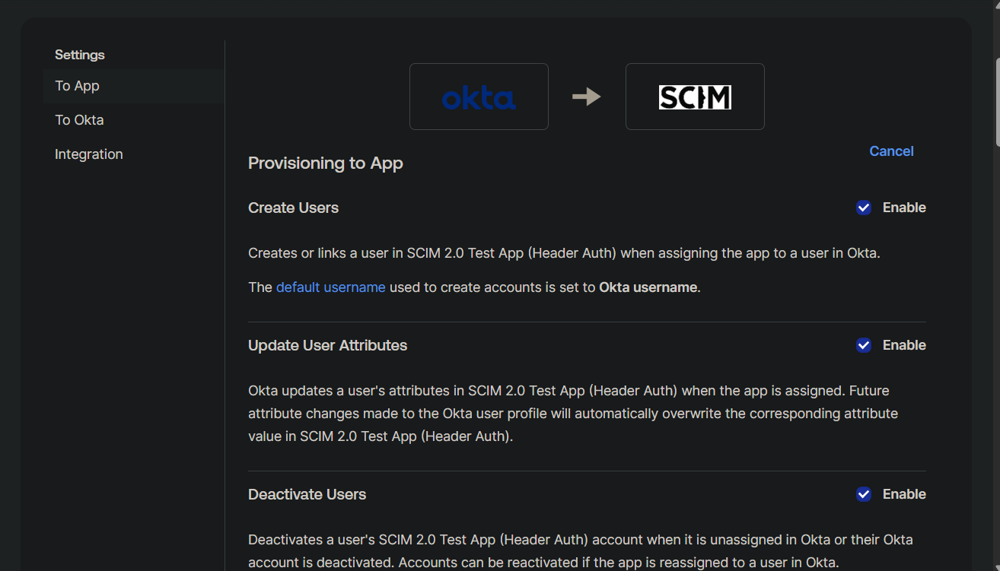

---

### Step 8 — Assign the Application to the Dynamic Group

**Goal:** Link the `SterlingBank IT Admin` dynamic group to the SCIM application, completing the provisioning chain from BambooHR through Okta to scim.dev.

1. On the `SterlingBank SCIM Practice App` page, navigate to the **Assignments** tab.
2. Click **Assign** → **Assign to Groups**.
3. Search for `SterlingBank IT Admin` and click **Assign** → accept default attribute mappings → **Save and Go Back** → **Done**.
4. Confirm `SterlingBank IT Admin` appears in the **Assignments** tab.
5. Navigate to **Directory** → **People** → open your test user (e.g. Kerry Jobs).
6. Click the **Applications** tab on the user profile.
7. Confirm `SterlingBank SCIM Practice App` is listed — this confirms the full provisioning chain is active.

```
Complete Provisioning Chain — Confirmed at End of Step 8
─────────────────────────────────────────────────────────
BambooHR employee record (dept=IT, title=security engineer)
    │  hourly scheduled import
    ▼
Okta user profile created/updated
    │  dynamic group rule evaluated
    ▼
SterlingBank IT Admin group  ← user automatically added
    │  group assigned to app
    ▼
SterlingBank SCIM Practice App  ← app appears on user profile
    │  SCIM provisioning event fired
    ▼
scim.dev /scim/v2/Users  ← POST /Users received and logged
```

> **Group-based assignment is the production-correct pattern.** Direct user-to-application assignment does not scale and requires manual intervention for every lifecycle event. Group-based assignment means access follows group membership automatically — and group membership follows BambooHR attributes automatically. The entire chain is attribute-driven with zero manual steps.

#### Screenshot
<!-- Add your screenshot here -->
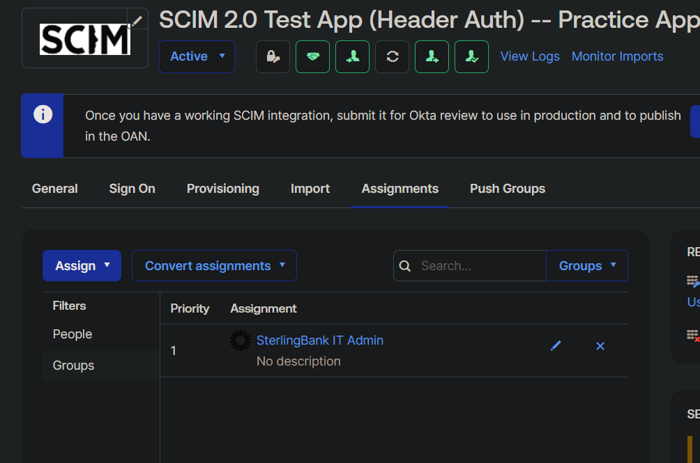

---

### Step 9 — Test the Joiner Workflow

**Goal:** Create a new employee in BambooHR and confirm the complete provisioning chain fires — from import through dynamic group to SCIM `POST /Users` in scim.dev.

```
Joiner Signal Flow
─────────────────────────────────────────────────────────
BambooHR: new employee (dept=IT, title=security engineer)
    ↓  Import Now
Okta: user profile created → rule matches → added to SterlingBank IT Admin
    ↓  group-to-app assignment triggers SCIM
scim.dev: POST /Users received → user record created → visible in HTTP logs
```

#### 9a — Create a New Employee in BambooHR

1. In BambooHR, create a new employee:
   - **First Name / Last Name:** any test name
   - **Email:** a unique test email address
   - **Department:** `IT`
   - **Job Title:** `security engineer`
2. Save the record.

#### 9b — Trigger Import in Okta

3. In Okta, navigate to the BambooHR integration → **Import** tab → **Import Now**.
4. Wait for the import to complete.
5. Confirm the new user appears in the summary — set status to **Managed** → **Confirm Assignments**.

#### 9c — Verify Group Membership and App Assignment

6. Navigate to **Directory** → **Groups** → `SterlingBank IT Admin`.
7. Confirm the new user appears as a member (added automatically by the dynamic rule).
8. Navigate to **Directory** → **People** → open the user → **Applications** tab.
9. Confirm `SterlingBank SCIM Practice App` is listed.

#### 9d — Observe the SCIM Event in scim.dev

10. Switch to the `scim.dev` browser tab.
11. Navigate to **Logs** → **HTTP Logs**.
12. Confirm a `POST /Users` request was received. The payload will resemble:

    ```json
    {
      "schemas": ["urn:ietf:params:scim:schemas:core:2.0:User"],
      "userName": "gordon@office.com",
      "name": {
        "givenName": "Gordon",
        "familyName": "Andy"
      },
      "emails": [{ "value": "Gordon@office.com", "primary": true }],
      "active": true
    }
    ```

13. Navigate to **Users** in scim.dev — confirm the user record is present with `active: true`.

> **What this confirms:** This is the exact JSON payload Okta sends to any SCIM-compliant enterprise application on user provisioning. The `POST /Users` call in scim.dev is identical in structure to what would be sent to a real banking application in production.

#### Screenshots — Joiner Workflow

<!-- Add your screenshot here -->
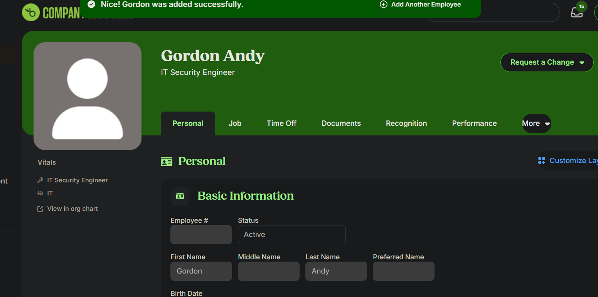

<!-- Add your screenshot here -->
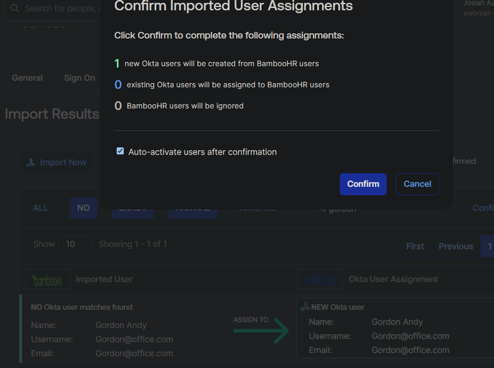

<!-- Add your screenshot here -->
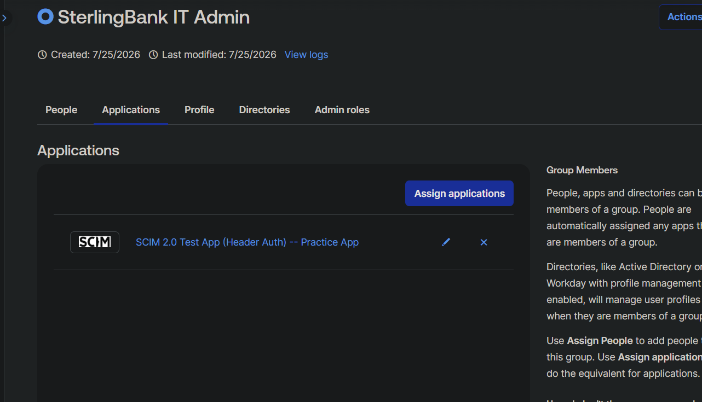

<!-- Add your screenshot here -->
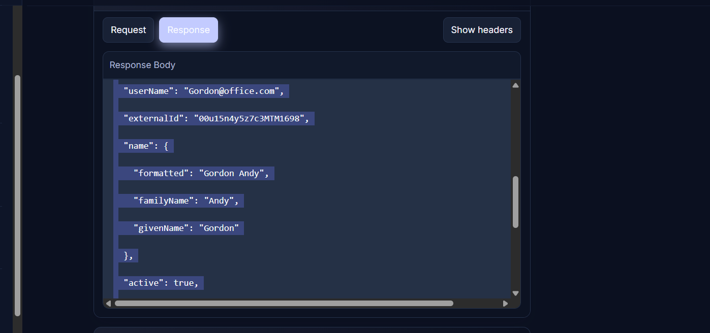

<!-- Add your screenshot here -->
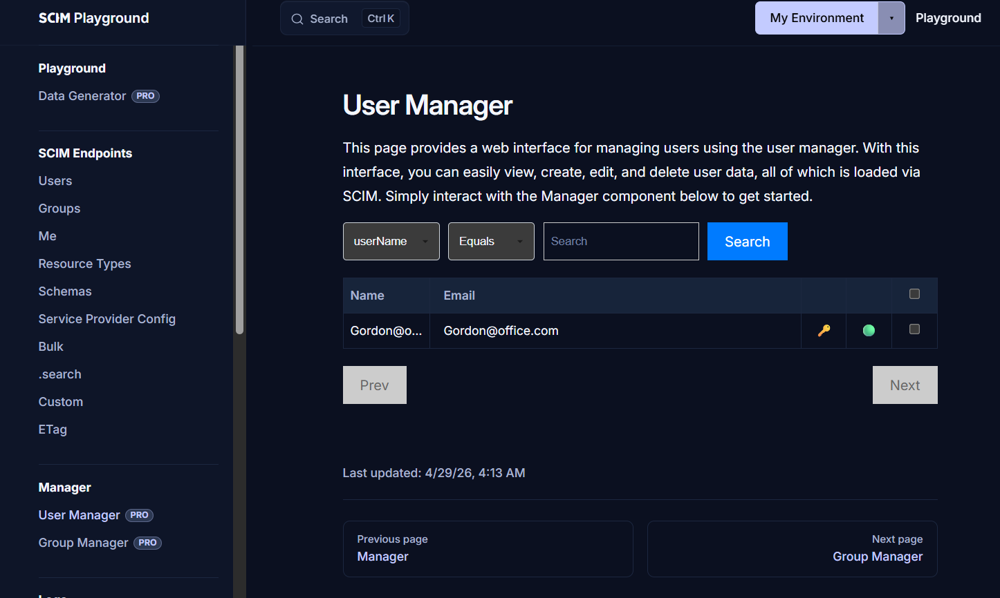

---

### Step 10 — Test the Mover Workflow

**Goal:** Update the employee's profile in BambooHR and confirm the change propagates through Okta and fires a `PATCH /Users/{id}` SCIM update in scim.dev.

```
Mover Signal Flow
─────────────────────────────────────────────────────────
BambooHR: employee firstName changed (e.g. "Gordon" → "Gordon Sunny")
    ↓  Import Now
Okta: existing user profile updated in Universal Directory
    ↓  Update User Attributes provisioning action fires
scim.dev: PATCH /Users/{id} received → user record updated
```

#### 10a — Update the Employee in BambooHR

1. In BambooHR, open the test employee's profile.
2. Change the **First Name** (e.g. from `Gordon` to `Gordon Sunny`).
3. Save the change.

#### 10b — Trigger Import in Okta

4. In Okta, navigate to the BambooHR integration → **Import** tab → **Import Now**.
5. Wait for completion. The summary should show **one existing user updated**.

#### 10c — Verify Profile Update in Okta

6. Navigate to **Directory** → **People** → open the user.
7. Confirm the first name reflects the BambooHR change in the Okta user profile.

#### 10d — Observe the SCIM Update in scim.dev

8. Switch to the `scim.dev` tab → **Logs** → **HTTP Logs**.
9. Confirm a `PATCH /Users/{id}` request was received. The payload will resemble:

   ```json
   {
     "schemas": ["urn:ietf:params:scim:api:messages:2.0:PatchOp"],
     "Operations": [
       {
         "op": "Replace",
         "path": "name.givenName",
         "value": "Gordon Sunny"
       }
     ]
   }
   ```

10. Navigate to **Users** in scim.dev — confirm the updated first name is reflected in the user record.

> **Timing note:** The one-hour BambooHR import schedule means attribute changes have a maximum propagation delay of one hour. In production environments requiring tighter sync, evaluate whether your HR platform supports webhook-based push events to Okta, which would trigger an import immediately on any record change.

#### Screenshots — Mover Workflow

<!-- Add your screenshot here -->
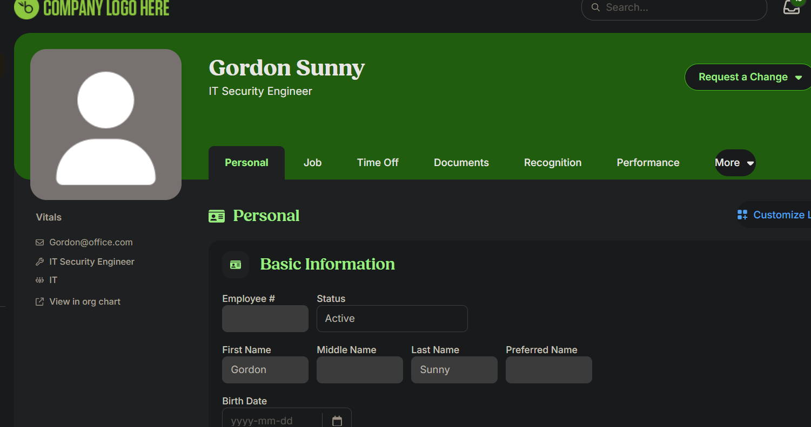

<!-- Add your screenshot here -->
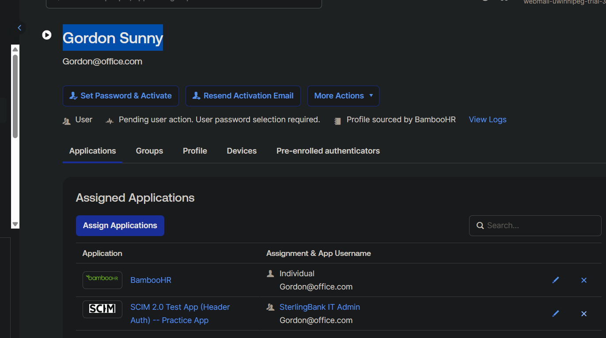

<!-- Add your screenshot here -->
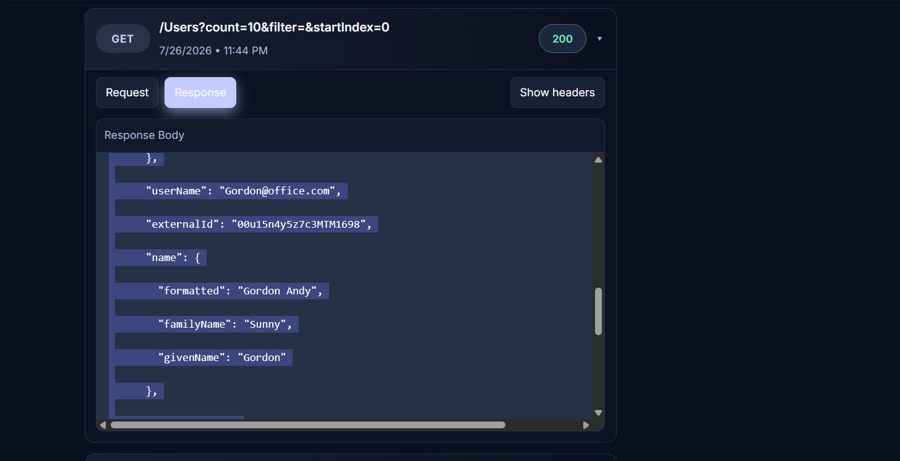

---

### Step 11 — Test the Leaver Workflow

**Goal:** Delete or terminate the employee in BambooHR and confirm the deactivation chain fires — user deactivated in Okta, removed from the group, and a `PATCH /Users/{id}` with `"active": false` sent to scim.dev.

```
Leaver Signal Flow
─────────────────────────────────────────────────────────
BambooHR: employee deleted or terminated
    ↓  Import Now
Okta: user deactivated → removed from SterlingBank IT Admin group
    ↓  Deactivate Users provisioning action fires
scim.dev: PATCH /Users/{id} with "active": false received
```

#### 11a — Delete or Terminate the Employee in BambooHR

1. In BambooHR, locate the test employee.
2. Delete or terminate the employee record and save.

#### 11b — Trigger Import in Okta

3. In Okta, navigate to the BambooHR integration → **Import** tab → **Import Now**.
4. The import summary should show **one user removed**.

#### 11c — Verify Deactivation in Okta

5. Navigate to **Directory** → **People**.
6. Locate the user — their status should now be **Deactivated**.
7. Confirm they have been automatically removed from `SterlingBank IT Admin`.
8. Confirm `SterlingBank SCIM Practice App` no longer appears in their **Applications** tab.

#### 11d — Observe the SCIM Deactivation in scim.dev

9. Switch to the `scim.dev` tab → **Logs** → **HTTP Logs**.
10. Confirm a `PATCH /Users/{id}` deactivation request was received:

    ```json
    {
      "schemas": ["urn:ietf:params:scim:api:messages:2.0:PatchOp"],
      "Operations": [
        {
          "op": "Replace",
          "path": "active",
          "value": false
        }
      ]
    }
    ```

11. Navigate to **Users** in scim.dev — confirm the user's `active` field is `false`.

#### 11e — Verify Okta Login Is Denied

12. Open a private/incognito browser window.
13. Attempt to sign in to the Okta End User Dashboard as the deactivated user.
14. Confirm the login is denied — the account is deactivated and no session can be established.

```
Leaver Verification Checklist
──────────────────────────────
[ ] Employee deleted/terminated in BambooHR
[ ] Okta import summary: "one user removed"
[ ] User status = Deactivated in Okta directory
[ ] User removed from SterlingBank IT Admin group
[ ] SterlingBank SCIM Practice App gone from user's Applications tab
[ ] scim.dev HTTP log: PATCH /Users/{id} with "active": false received
[ ] scim.dev Users tab: active = false confirmed on user record
[ ] Okta login denied for deactivated user
```

#### Screenshots — Leaver Workflow

<!-- Add your screenshot here -->
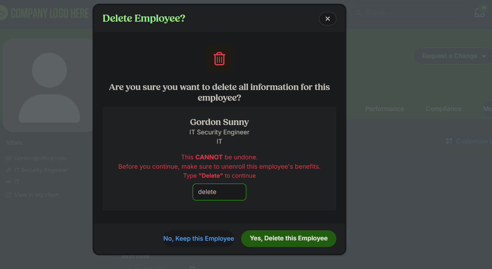

<!-- Add your screenshot here -->
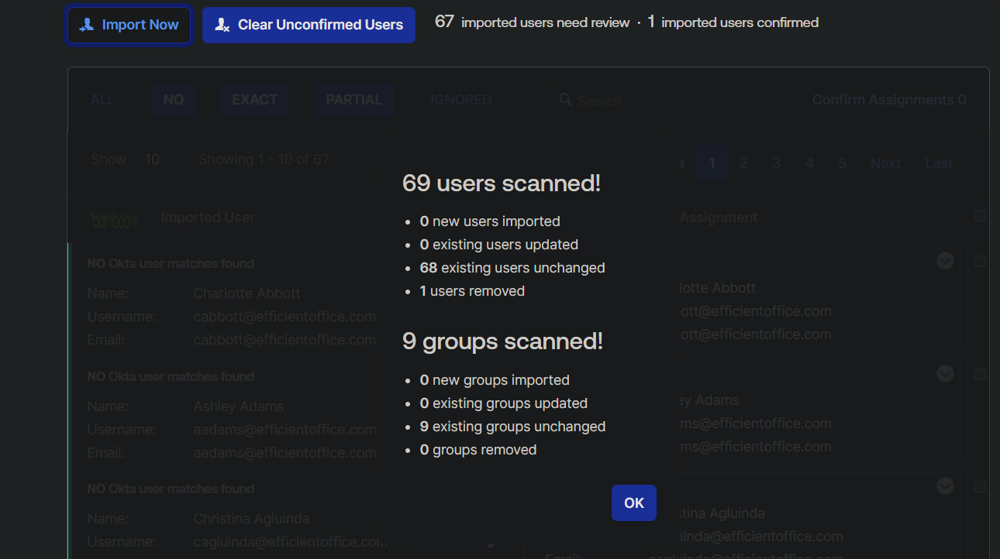

<!-- Add your screenshot here -->
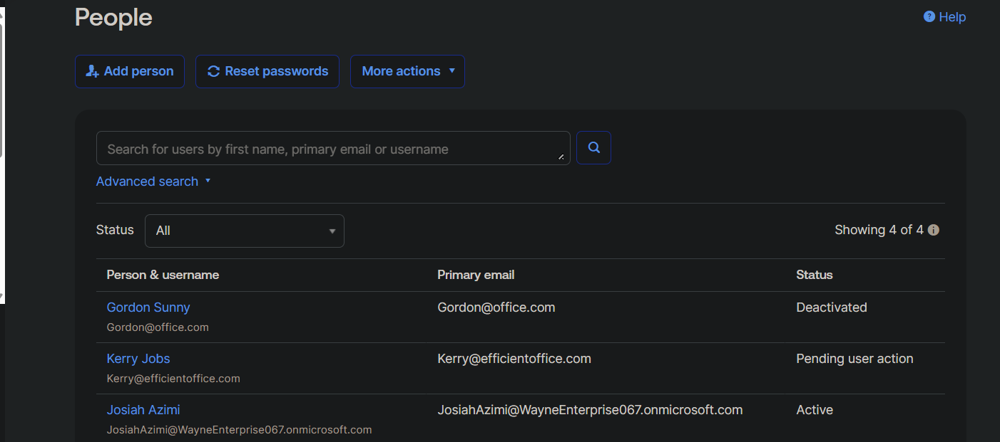

<!-- Add your screenshot here -->
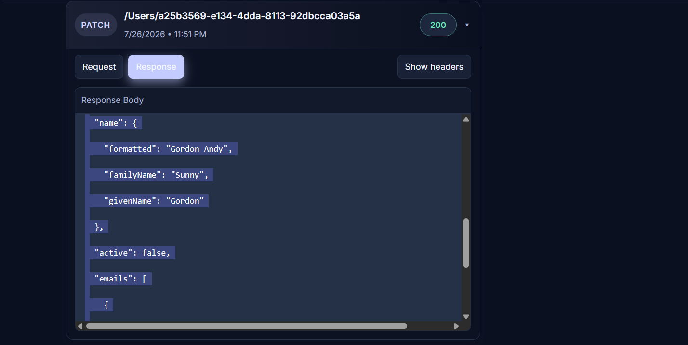

<!-- Add your screenshot here -->
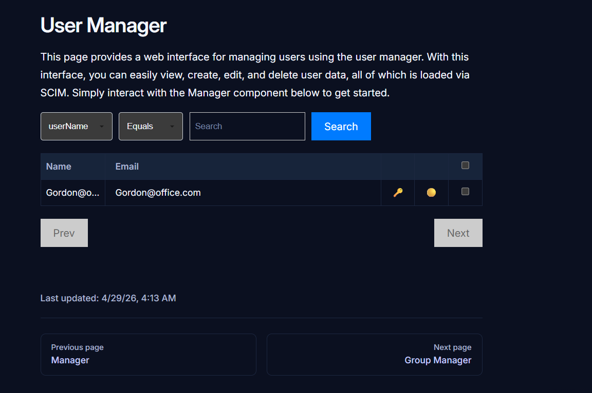

---

## JML Workflow Reference

| Phase | BambooHR Trigger | Okta Action | scim.dev / SterlingBank Action |
|---|---|---|---|
| **Joiner** | New employee created (dept=IT, title=security engineer) | User imported → rule matches → added to `SterlingBank IT Admin` → app assigned | `POST /Users` — user account created, `active: true` |
| **Mover (attribute)** | Employee profile updated (name, department, title) | User profile updated in Universal Directory → Update Attributes action fires | `PATCH /Users/{id}` — specific attribute replaced |
| **Mover (role change)** | Title or department changes so rule no longer matches | User removed from `SterlingBank IT Admin` group | `PATCH /Users/{id}` with `"active": false` — access revoked |
| **Leaver** | Employee terminated or deleted | User deactivated in Okta → removed from all groups | `PATCH /Users/{id}` with `"active": false` — session invalidated |

---

## Best Practices Summary

| # | Practice |
|---|---|
| 1 | **BambooHR is the only source of truth** — never create or edit HR-owned identity attributes directly in Okta or downstream apps |
| 2 | **Use dynamic groups with expression rules** — attribute-driven membership eliminates manual access management at scale |
| 3 | **SCIM endpoints must use HTTPS** — SCIM is a privileged write API; plain HTTP is never acceptable in production |
| 4 | **Never enable import from resource servers** — data flow must be unidirectional (BambooHR → Okta → app); circular flow corrupts authoritative data |
| 5 | **Use `userName` or `email` as the SCIM unique identifier** — stable, present across all systems, and avoids matching failures on display name changes |
| 6 | **Assign applications to groups, not individual users** — direct user assignment breaks the automation model and requires manual intervention for every lifecycle event |
| 7 | **Do not sync passwords via SCIM** — authentication is handled by Okta SSO; SCIM manages account lifecycle, not credentials |
| 8 | **Test all three JML phases before signing off** — an integration that provisions joiners but silently fails on leavers is a security liability |
| 9 | **Verify deactivation in the resource server, not only in Okta** — confirm `active: false` reached scim.dev (or the real app); Okta deactivation alone does not guarantee downstream revocation |
| 10 | **Account for the hourly import delay in your offboarding SLA** — a terminated employee may retain access for up to one hour if BambooHR uses scheduled sync rather than real-time webhooks |

---

## Key Concepts Reference

| Term | Description |
|---|---|
| **JML (Joiner Mover Leaver)** | The three lifecycle phases every employee identity passes through in an organisation |
| **Authoritative Source** | The system of record for identity data — all other systems consume from it, never write back to it |
| **SCIM 2.0** | System for Cross-domain Identity Management — a REST API standard for automating user account provisioning and deprovisioning |
| **Dynamic Group** | An Okta group whose membership is automatically evaluated and managed by an expression rule |
| **Okta Expression Language** | Attribute-based rule syntax used in Okta group rules (e.g. `user.department == "IT"`) |
| **Provisioning** | Automated creation of a user account and access entitlements in a downstream application |
| **Deprovisioning** | Automated removal or deactivation of a user account when access is no longer warranted |
| **Profile Sourcing** | Designating an application (BambooHR) as the master source for specific user profile attributes in Okta |
| **scim.dev** | A free, browser-based SCIM 2.0 sandbox used in this lab to receive and inspect Okta's provisioning events |
| **Identity Drift** | The accumulation of stale, orphaned, or inconsistent identity data when lifecycle events are managed manually across disconnected systems |
| **Scheduled Import** | A periodic sync from BambooHR to Okta; BambooHR does not support real-time webhook sync, introducing an up-to-one-hour propagation delay |

---

## Resources

- [Okta — BambooHR Integration Guide](https://help.okta.com/en-us/content/topics/provisioning/bamboohr/bamboohr-main.htm)
- [Okta — SCIM Provisioning Overview](https://developer.okta.com/docs/concepts/scim/)
- [Okta — SCIM 2.0 Test App Setup](https://developer.okta.com/docs/guides/scim-provisioning-integration-overview/)
- [Okta — Group Rules and Expression Language](https://help.okta.com/en-us/content/topics/users-groups-profiles/usgp-about-group-rules.htm)
- [Okta Expression Language Reference](https://developer.okta.com/docs/reference/okta-expression-language/)
- [scim.dev — Free SCIM 2.0 Sandbox](https://scim.dev)
- [SCIM 2.0 Specification — RFC 7644](https://datatracker.ietf.org/doc/html/rfc7644)
- [BambooHR API Documentation](https://documentation.bamboohr.com/docs)

---

*Lab implementing a complete Joiner Mover Leaver identity lifecycle — BambooHR as the authoritative HR source, Okta as the identity broker with dynamic group rules and SCIM provisioning, and a SterlingBank application validated via the scim.dev SCIM 2.0 sandbox — covering all three lifecycle phases end-to-end with live HTTP log evidence.*
